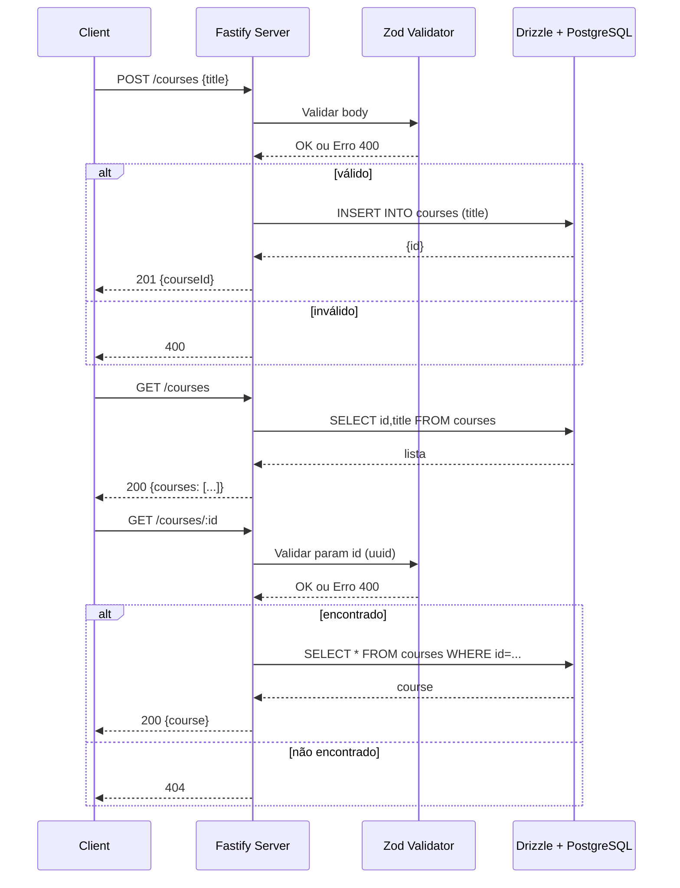

# 🚀 Desafio Node.js - Rocketseat

Uma API REST completa para gerenciamento de cursos, construída com Node.js, Fastify e PostgreSQL.

## 📋 Índice

- [Sobre o Projeto](#sobre-o-projeto)
- [Tecnologias Utilizadas](#tecnologias-utilizadas)
- [Funcionalidades](#funcionalidades)
- [Pré-requisitos](#pré-requisitos)
- [Como Executar](#como-executar)
- [Estrutura do Projeto](#estrutura-do-projeto)
- [API Endpoints](#api-endpoints)
- [Banco de Dados](#banco-de-dados)
- [Fluxo da Aplicação](#fluxo-da-aplicação)

## 🎯 Sobre o Projeto

Este projeto é uma API REST para gerenciamento de cursos, desenvolvida como parte do desafio da Rocketseat. A aplicação permite criar, listar e buscar cursos específicos, utilizando as melhores práticas de desenvolvimento com TypeScript, validação de dados e documentação automática da API.

## 🛠️ Tecnologias Utilizadas

### Backend
- **Node.js** - Runtime JavaScript
- **TypeScript** - Linguagem de programação tipada
- **Fastify** - Framework web rápido e eficiente
- **Drizzle ORM** - ORM moderno para TypeScript
- **PostgreSQL** - Banco de dados relacional

### Validação e Documentação
- **Zod** - Validação de schemas e tipos
- **Swagger/OpenAPI** - Documentação automática da API
- **Scalar API Reference** - Interface visual para documentação

### Desenvolvimento
- **Drizzle Kit** - Ferramentas de migração e gerenciamento do banco
- **Pino Pretty** - Logging formatado para desenvolvimento
- **Docker Compose** - Orquestração de containers

## ✨ Funcionalidades

- ✅ Criação de cursos
- ✅ Listagem de todos os cursos
- ✅ Busca de curso por ID
- ✅ Validação de dados com Zod
- ✅ Documentação automática da API
- ✅ Logging estruturado
- ✅ Migrações de banco de dados

## 📋 Pré-requisitos

- Node.js 18+ 
- Docker e Docker Compose
- Git

## 🚀 Como Executar

### 1. Clone o repositório
```bash
git clone https://github.com/rocketseat-education/desafio-api-nodejs.git
cd desafio-node-js-rocketseat
```

### 2. Instale as dependências
```bash
npm install
```

### 3. Configure as variáveis de ambiente
Crie um arquivo `.env` na raiz do projeto:
```env
DATABASE_URL=
NODE_ENV=
```

### 4. Inicie o banco de dados
```bash
docker-compose up -d
```

### 5. Execute as migrações
```bash
npm run db:generate
npm run db:migrate
```

### 6. Inicie a aplicação
```bash
npm run dev
```

A API estará disponível em `http://localhost:3333`

## 📁 Estrutura do Projeto

```
desafio-node-js-rocketseat/
├── src/
│   ├── database/
│   │   ├── client.ts          # Conexão com banco de dados
│   │   └── schema.ts          # Schemas das tabelas
│   └── routes/
│       ├── create-courses.ts   # Rota para criar cursos
│       ├── get-courses.ts      # Rota para listar cursos
│       └── get-courses-by-id.ts # Rota para buscar curso por ID
├── drizzle/                    # Migrações do banco
├── docker-compose.yml          # Configuração do PostgreSQL
├── server.ts                   # Servidor principal
└── package.json
```

## 🔌 API Endpoints

### POST /courses
Cria um novo curso.

**Body:**
```json
{
  "title": "Nome do Curso"
}
```

**Response (201):**
```json
{
  "courseId": "uuid-do-curso"
}
```

### GET /courses
Lista todos os cursos.

**Response (200):**
```json
{
  "courses": [
    {
      "id": "uuid-do-curso",
      "title": "Nome do Curso"
    }
  ]
}
```

### GET /courses/:id
Busca um curso específico por ID.

**Response (200):**
```json
{
  "course": {
    "id": "uuid-do-curso",
    "title": "Nome do Curso",
    "description": "Descrição do curso"
  }
}
```

## 🗄️ Banco de Dados

### Tabela: courses
- `id` (UUID, Primary Key) - Identificador único do curso
- `title` (Text, Not Null, Unique) - Título do curso
- `description` (Text, Nullable) - Descrição do curso

### Tabela: users
- `id` (UUID, Primary Key) - Identificador único do usuário
- `name` (Text, Not Null) - Nome do usuário
- `email` (Text, Not Null, Unique) - Email do usuário


## 🔄 Fluxo da Aplicação

### Diagrama de Fluxo Principal



### Descrição do Fluxo

1. **Inicialização**: O servidor Fastify é iniciado com validação Zod e documentação Swagger
2. **Validação**: Todas as requisições passam por validação de schema usando Zod
3. **Criação de Cursos**: 
   - Valida título (mínimo 5 caracteres)
   - Insere no PostgreSQL
   - Retorna ID do curso criado
4. **Listagem de Cursos**: Consulta todos os cursos do banco
5. **Busca por ID**: Valida UUID e busca curso específico no banco

## 📚 Comandos Úteis

```bash
# Desenvolvimento
npm run dev                    # Inicia servidor em modo desenvolvimento

# Banco de dados
npm run db:generate           # Gera novas migrações
npm run db:migrate            # Executa migrações pendentes
npm run db:studio             # Abre interface visual do Drizzle

# Docker
docker-compose up -d          # Inicia PostgreSQL
docker-compose down           # Para PostgreSQL
```

## 🌐 Documentação da API

Em modo desenvolvimento, a documentação está disponível em:
- **Scalar API Reference**: `http://localhost:3333/docs`

## 🔧 Configurações

### Portas
- **API**: 3333
- **PostgreSQL**: 5432

### Variáveis de Ambiente
- `DATABASE_URL`: URL de conexão com PostgreSQL
- `NODE_ENV`: Ambiente de execução (development/production)

## 📝 Licença

Este projeto foi desenvolvido como parte do desafio da Rocketseat.

---

**Desenvolvido com ❤️ usando as melhores práticas de desenvolvimento Node.js**
